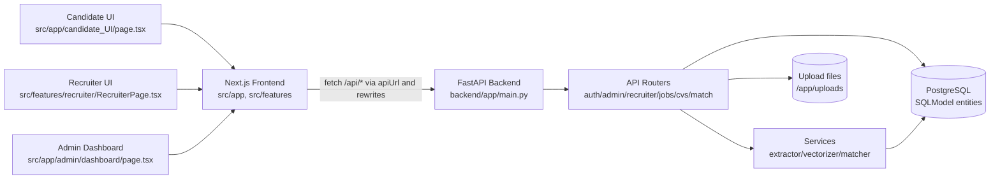
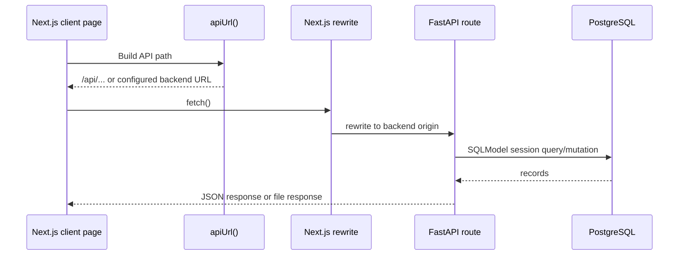
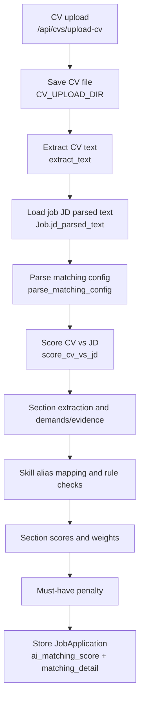
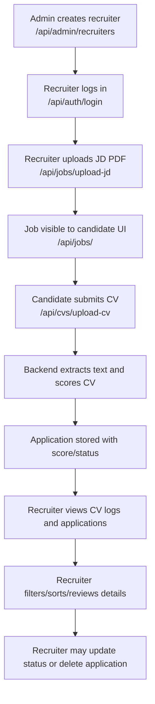
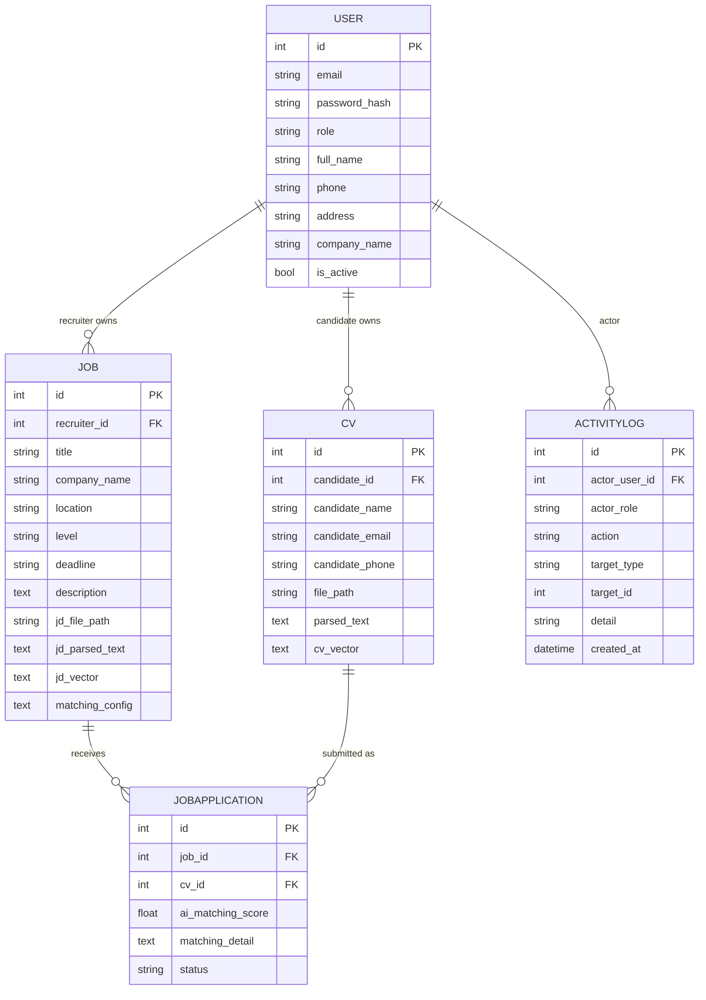

# Code-Extracted Report Materials

Project: **Intelligent CV Screening and Recruitment Management**

Scope: This document collects technical, architectural, functional, and implementation evidence from the current repository for academic/technical report writing. It does not describe unimplemented behavior as implemented. Proposed improvements are explicitly marked.

## 1. Repository Overview

### Repository Structure Summary

| Folder/File | Purpose | Important evidence | Related report chapter |
|---|---|---|---|
| `src/app/` | Next.js App Router pages for public, candidate, recruiter, and admin interfaces | `src/app/layout.tsx`, `src/app/page.tsx`, `src/app/login/page.tsx`, `src/app/candidate_UI/page.tsx`, `src/app/recruiter_UI/page.tsx`, `src/app/admin/dashboard/page.tsx` | Frontend Implementation, UI/UX |
| `src/features/recruiter/` | Recruiter dashboard feature module with components, types, API wrappers, scoring utilities, and mock mapper utilities | `src/features/recruiter/RecruiterPage.tsx`, `src/features/recruiter/services/recruiterApi.ts`, `src/features/recruiter/utils/cvScoringUtils.ts`, `src/features/recruiter/types/recruiterTypes.ts` | Functional Modules, Recruiter Workflow |
| `src/components/` | Shared UI components such as navbar, job cards, and brand logo | `src/components/Jobcard.tsx`, `src/components/navbar/Navbar.tsx`, `src/components/navbar/Navbar_candidate.tsx`, `src/components/brand/BrandLogo.tsx` | Frontend Implementation |
| `src/utils/` | Frontend utility layer for API URL creation, login, registration, and admin login handling | `src/utils/api.ts`, `src/utils/loginHandler.ts`, `src/utils/registerHandler.ts`, `src/utils/adminLoginHandler.ts` | API Communication, Authentication |
| `src/mock/` | Mock job and CV-screening data used by candidate/recruiter UI, especially FPT demo data | `src/mock/cvScreeningMockData.ts`, `src/features/recruiter/utils/recruiterMockMappers.ts` | Mock Data, Limitations |
| `backend/app/` | FastAPI backend application, including entry point, database, models, security, routes, and services | `backend/app/main.py`, `backend/app/models.py`, `backend/app/database.py`, `backend/app/security.py` | Backend Implementation |
| `backend/app/routes/` | Backend API routers for auth, admin, recruiter, jobs, CVs, and standalone matching | `backend/app/routes/auth.py`, `admin.py`, `recruiter.py`, `jobs.py`, `cvs.py`, `match.py` | API Endpoint Inventory |
| `backend/app/services/` | CV/JD parsing, vectorization, matching/scoring, matching config, and demo pipeline logic | `backend/app/services/extractor.py`, `matcher.py`, `vectorizer.py`, `ai_service.py`, `matching_config.py`, `skill_aliases.json` | CV-JD Matching Pipeline |
| `backend/tests/` | Backend unit tests for auth, admin, recruiter permissions, CV upload, JD matching config, matching details, and matcher behavior | `backend/tests/test_matcher_simple.py`, `test_cvs_upload.py`, `test_auth_routes.py`, `test_admin_routes.py` | Testing and Evaluation |
| `backend/uploads/` | Local upload storage directory in development/runtime | Used by upload routes and Docker volume; runtime/generated content | Deployment, File Handling |
| `backend/docker-compose.yml` | Local PostgreSQL and backend container orchestration | Services `db` and `backend`, Postgres 16, backend port `8000` | Deployment |
| `backend/Dockerfile` | Backend container image using Python 3.11, Tesseract OCR, and Uvicorn | Installs `tesseract-ocr`, `tesseract-ocr-vie`, `tesseract-ocr-eng`, Python requirements | Deployment |
| `package.json` | Frontend package metadata and scripts | `next` 16.2.1, React 19.2.4, scripts `dev`, `build`, `start`, `lint` | Technology Stack |
| `backend/requirements.txt` | Backend Python dependencies | FastAPI, SQLModel, PostgreSQL drivers, OCR/parsing, sentence-transformers, scikit-learn | Technology Stack |
| `next.config.ts` | Next.js rewrite configuration from `/api/*` and `/uploads/*` to backend | `API_BASE_URL` or `NEXT_PUBLIC_API_BASE_URL` based backend origin | Frontend-Backend Integration |
| `.env.example`, `backend/.env.example` | Environment variable templates | Frontend API target, backend database URL, admin account, CORS, upload URL | Deployment |
| `vercel.json`, `backend/railway.json` | Deployment metadata for Vercel frontend and Railway backend | Vercel build/dev/install commands; Railway Dockerfile and healthcheck `/health` | Deployment |
| `.next/`, `node_modules/`, `.venv/`, `backend/.venv/`, `.git/`, `.vercel/` | Generated, dependency, virtual environment, or tooling folders; should be ignored for report evidence except to identify generated artifacts | Folder listing from repository inspection | Appendix / Exclusions |

### Main Project Purpose

The repository implements a web-based recruitment management system that allows candidates to view jobs and submit CVs, recruiters to upload job descriptions and review scored CV submissions, and admins to manage recruiters, jobs, and activity logs. The backend includes a CV-JD matching engine that extracts document text, maps skill aliases, computes section-level matches, applies configurable weights and must-have penalties, and returns explainable score details. Evidence: `backend/app/routes/cvs.py`, `backend/app/routes/jobs.py`, `backend/app/services/matcher.py`, `src/app/candidate_UI/page.tsx`, `src/features/recruiter/RecruiterPage.tsx`, `src/app/admin/dashboard/page.tsx`.

### Main Application Layers

| Layer | Evidence |
|---|---|
| Frontend | Next.js App Router pages under `src/app/`, React client components, CSS Modules, local state through React hooks |
| Backend | FastAPI application in `backend/app/main.py`, routers in `backend/app/routes/` |
| Database | SQLModel models in `backend/app/models.py`, SQLAlchemy engine/session in `backend/app/database.py`, PostgreSQL configured in `backend/docker-compose.yml` |
| AI / Matching / Scoring | Text extraction in `extractor.py`, vectorization in `vectorizer.py`, detailed matching in `matcher.py`, vector cosine fallback in `ai_service.py` |
| Testing | Python tests under `backend/tests/`; frontend lint script in `package.json`; verification scripts under `scripts/` |
| Deployment / Runtime | Docker Compose, backend Dockerfile, Railway config, Vercel config, Next.js rewrite configuration |

## 2. Project Overview

### Project Overview for Report

The project is named **Intelligent CV Screening and Recruitment Management**. It belongs to the recruitment technology domain, specifically the automation of CV submission, job description management, candidate screening, and recruiter decision support. The target users are candidates, recruiters, and administrators. The implemented roles are represented by the `User.role` field with values `candidate`, `recruiter`, and `admin` in `backend/app/models.py`.

The main system objectives are to centralize recruitment data, support job/JD posting, allow candidates or guests to submit CV files, automatically extract CV text, compute CV-JD matching scores, and display scored candidate lists to recruiters. The system scope includes authentication, candidate registration/login, recruiter login and forced password change for default credentials, admin recruiter management, job/JD upload, CV upload, matching score calculation, candidate ranking/filtering in the recruiter UI, and activity logging. Evidence: `backend/app/routes/auth.py`, `backend/app/routes/admin.py`, `backend/app/routes/jobs.py`, `backend/app/routes/cvs.py`, `backend/app/routes/recruiter.py`, `src/features/recruiter/RecruiterPage.tsx`.

Expected benefits include reduced manual screening effort, more consistent initial candidate ranking, improved traceability of candidate submissions, and a clearer management interface for HR operations. The project contribution is a full-stack prototype that combines recruitment workflow management with an explainable section-based CV-JD scoring engine rather than only storing job and CV records.

### Introduction Paragraph

Recruitment screening is a repetitive and information-intensive process in which recruiters must compare many CVs against job requirements under time pressure. The Intelligent CV Screening and Recruitment Management system addresses this problem through a web application that manages job descriptions, candidate CV submissions, recruiter review, and administrative oversight. The system implements a FastAPI backend, a Next.js frontend, a relational database model, and a CV-JD matching engine that extracts document text and produces score details for recruiter review. The current implementation should be understood as a functional prototype with implemented scoring logic, upload flows, role-based screens, and identifiable areas for future evaluation and production hardening.

## 3. Problem Statement and Motivation

Manual CV screening is inefficient because recruiters must repeatedly inspect candidate documents, interpret inconsistent CV formats, and compare candidate evidence against structured and unstructured job requirements. In this project, the codebase addresses that pain point by allowing candidates to submit files through `src/app/candidate_UI/page.tsx`, extracting text in `backend/app/services/extractor.py`, and creating `CV` plus `JobApplication` records in `backend/app/routes/cvs.py`.

Recruitment management needs automation because candidate submissions, JD records, recruiter ownership, status tracking, and audit logs can become difficult to manage manually. The repository implements automated storage of jobs, CVs, applications, and activity logs through SQLModel entities in `backend/app/models.py`. Admin and recruiter routes provide operational APIs for listing recruiters, jobs, applications, and logs through `backend/app/routes/admin.py` and `backend/app/routes/recruiter.py`.

CV-JD matching is useful because it creates an initial ranking signal before human review. The implemented matcher evaluates candidate evidence against job demands using section extraction, skill alias mapping, rule-based checks, section weights, and must-have penalties. Evidence: `score_cv_vs_jd`, `_section_result`, `_infer_must_have`, and `rule_based_checks` in `backend/app/services/matcher.py`.

Current limitations remain. The repository does not contain a labeled evaluation dataset, production-grade authorization tokens, frontend end-to-end tests, or formal ranking evaluation metrics. Some UI behavior uses mock/localStorage data, especially FPT demo data in `src/mock/cvScreeningMockData.ts` and `src/features/recruiter/utils/recruiterMockMappers.ts`. Therefore, report claims about accuracy, fairness, and production readiness require external evaluation and manual confirmation.

## 4. Technology Stack

| Layer | Technology / Library / Framework | Purpose in the system | Evidence path | Confidence |
|---|---|---|---|---|
| Frontend framework | Next.js 16.2.1 | App Router web frontend and build framework | `package.json`, `src/app/*/page.tsx` | high |
| Frontend UI library | React 19.2.4 / React DOM 19.2.4 | Component rendering and state management | `package.json`, `useState`, `useEffect` imports in frontend files | high |
| Frontend language | TypeScript | Typed frontend code | `tsconfig.json`, `.tsx` and `.ts` files | high |
| Styling | CSS Modules and global CSS | Page-specific bright/dark themes and dashboards | `src/app/*/*.module.css`, `src/app/globals.css` | high |
| Frontend API integration | Fetch API plus `apiUrl()` helper | Calls backend routes through rewrites or direct base URL | `src/utils/api.ts`, `src/features/recruiter/services/recruiterApi.ts` | high |
| Backend framework | FastAPI 0.135.3 | HTTP API framework | `backend/requirements.txt`, `backend/app/main.py` | high |
| Backend server | Uvicorn | ASGI runtime | `backend/requirements.txt`, `backend/Dockerfile` | high |
| Backend language | Python 3.11 | Backend service implementation | `backend/Dockerfile`, `.py` files | high |
| Database | PostgreSQL 16 | Persistent relational database in Docker Compose | `backend/docker-compose.yml` | high |
| ORM / DB library | SQLModel, SQLAlchemy | Models, sessions, startup migrations | `backend/app/models.py`, `backend/app/database.py`, `backend/requirements.txt` | high |
| PostgreSQL driver | psycopg / psycopg2-binary | PostgreSQL connectivity | `backend/requirements.txt` | high |
| Authentication/security | bcrypt | Password hashing and verification | `backend/app/security.py`, `backend/requirements.txt` | high |
| JWT library | python-jose | Installed but not visibly used in current auth routes | `backend/requirements.txt`; no active import found in routes | medium |
| File upload | FastAPI `UploadFile`, `python-multipart` | JD/CV multipart upload handling | `backend/app/routes/jobs.py`, `backend/app/routes/cvs.py`, `backend/requirements.txt` | high |
| PDF parsing | PyMuPDF (`fitz`) | Extract text from PDF CV/JD files | `backend/app/services/extractor.py`, `backend/requirements.txt` | high |
| DOCX parsing | `python-docx` | Extract text from DOCX CV files | `backend/app/services/extractor.py`, `backend/requirements.txt` | high |
| Image OCR | Tesseract, pytesseract, Pillow | Extract text from image CVs | `backend/app/services/extractor.py`, `backend/Dockerfile`, `backend/requirements.txt` | high |
| Embeddings | sentence-transformers | Optional embedding vectors and semantic scoring | `backend/app/services/vectorizer.py`, `backend/app/services/matcher.py`, `backend/requirements.txt` | high |
| ML similarity | scikit-learn TF-IDF and cosine similarity | Section similarity fallback/feature representation | `backend/app/services/matcher.py`, `backend/requirements.txt` | high |
| Vector math | PyTorch and sentence-transformers util | Vector cosine scoring in fallback service | `backend/app/services/ai_service.py`; dependency transitive/implicit | medium |
| Testing | Python unit tests with plain assertions | Backend route/service tests | `backend/tests/test_*.py`, `backend/tests/run_tests.py` | high |
| Frontend linting | ESLint | Static checking script | `package.json`, `eslint.config.mjs` | high |
| Deployment | Docker, Docker Compose | Backend and local PostgreSQL runtime | `backend/Dockerfile`, `backend/docker-compose.yml` | high |
| Frontend deployment | Vercel | Next.js frontend deployment metadata | `vercel.json`, `.env.example` | high |
| Backend deployment | Railway | Backend Docker deployment metadata | `backend/railway.json`, `backend/.env.example` | high |
| Configuration | dotenv / environment variables | Database URL, CORS, upload URL, API base URL | `backend/app/database.py`, `backend/.env.example`, `.env.example` | high |

## 5. Overall System Architecture

### Architecture Description

The frontend is a Next.js application using App Router pages and client-side React state. It communicates with the backend through `fetch()` calls wrapped by `apiUrl()` in `src/utils/api.ts`. In local or production deployment, `next.config.ts` rewrites `/api/:path*` and `/uploads/:path*` to the configured FastAPI backend.

The backend is a FastAPI application initialized in `backend/app/main.py`. It configures CORS, mounts `/uploads`, creates database tables during lifespan startup, and includes routers for authentication, admin, recruiter, matching, jobs, and CVs. The database layer uses SQLModel entities for users, jobs, CVs, applications, and activity logs. Startup migrations in `backend/app/database.py` add missing columns non-destructively.

The matching pipeline is triggered mainly during CV upload in `backend/app/routes/cvs.py`. If both parsed CV text and stored JD parsed text exist, the backend calls `score_cv_vs_jd()` from `backend/app/services/matcher.py`, stores `ai_matching_score`, and serializes detailed matching output into `JobApplication.matching_detail`.

### Overall System Architecture



### Frontend-to-Backend Request Flow



### CV-JD Matching/Scoring Pipeline



### Recruitment Workflow



### Database / Entity Relationship Overview



## 6. Functional Modules

| Module name | Description | User role involved | Frontend files/components/pages | Backend files/routes/services | Database models involved | Current status | Evidence |
|---|---|---|---|---|---|---|---|
| Login/Register/Auth | Candidate self-registers; users log in; recruiter default-password change flow exists | candidate, recruiter, admin | `src/app/login/page.tsx`, `src/app/register/candidate/page.tsx`, `src/app/admin/login/page.tsx`, `src/app/recruiter/login/page.tsx`, `src/app/recruiter/change-password/page.tsx`, `src/utils/loginHandler.ts` | `backend/app/routes/auth.py`, `backend/app/security.py` | `User`, `ActivityLog` | implemented, but session auth is localStorage/query-based rather than token-secured | `register_user`, `login_user`, `change_password` |
| Dashboard | Role-specific dashboard views for admin and recruiter | admin, recruiter | `src/app/admin/dashboard/page.tsx`, `src/features/recruiter/RecruiterPage.tsx` | `backend/app/routes/admin.py`, `backend/app/routes/recruiter.py` | `User`, `Job`, `CV`, `JobApplication`, `ActivityLog` | implemented | `admin_overview`, `list_recruiter_cv_logs` |
| Job/JD management | Recruiter uploads JD PDF and creates job card; admin can list/delete jobs; recruiter UI can locally turn off/delete jobs | recruiter, admin | `RecruiterPage.tsx`, `recruiterApi.ts`, `admin/dashboard/page.tsx` | `backend/app/routes/jobs.py`, `backend/app/routes/admin.py`, `backend/app/routes/recruiter.py` | `Job`, `ActivityLog`, `JobApplication` | partially implemented; recruiter UI job deletion/turn-off is partly localStorage, backend has recruiter delete endpoint | `upload_jd`, `admin_delete_job`, `delete_recruiter_job` |
| Candidate management | Admin can delete candidates; candidates can update profile | admin, candidate | Candidate UI, admin dashboard | `backend/app/routes/admin.py`, `backend/app/routes/auth.py` | `User`, `CV`, `JobApplication`, `ActivityLog` | partially implemented | `admin_delete_candidate`, `update_candidate_profile` |
| CV upload | Candidate or guest submits CV to job | candidate, guest | `src/app/candidate_UI/page.tsx` | `backend/app/routes/cvs.py`, `backend/app/services/extractor.py` | `CV`, `JobApplication`, `Job`, `ActivityLog` | implemented | `/api/cvs/upload-cv` |
| CV parsing | Extracts text from PDF, DOCX, JPG/JPEG/PNG | backend service | indirectly through candidate UI | `backend/app/services/extractor.py` | `CV.parsed_text` | implemented with dependency limits | `extract_text_from_pdf`, `extract_text_from_docx`, `extract_text_from_image` |
| CV screening | Recruiter sees submitted CV logs, scores, filters, details | recruiter | `RecruiterPage.tsx`, `cvScoringUtils.ts`, `recruiterTypes.ts` | `backend/app/routes/recruiter.py` | `JobApplication`, `CV`, `Job`, `ActivityLog` | implemented | `list_recruiter_cv_logs`, `fetchRecruiterCvLogs` |
| CV-JD matching/scoring | Section-based scoring with alias mapping, weights, must-have penalty, details | backend/recruiter | Recruiter matching detail UI types/utilities | `backend/app/services/matcher.py`, `backend/app/routes/cvs.py`, `backend/app/routes/match.py` | `JobApplication.ai_matching_score`, `matching_detail` | implemented | `score_cv_vs_jd`, `_section_result` |
| Candidate ranking | Recruiter UI sorts CV logs by score or experience and filters by score status/range | recruiter | `RecruiterPage.tsx`, `cvScoringUtils.ts` | backend returns CV logs with score and matching detail | `JobApplication` | frontend implemented | `sortCvLogs`, `filteredLogs`, `sortedFilteredLogs` |
| Search/filter/sort | Candidate job search/category filter; recruiter JD search and CV filters | candidate, recruiter | `candidate_UI/page.tsx`, `RecruiterPage.tsx` | API list endpoints | `Job`, `JobApplication` | implemented mostly on frontend | `filteredJobs`, `filteredLogs`, `submitJobSearch` |
| Admin/user management | Admin creates/list recruiters, lists jobs/activity/overview, deletes jobs/candidates/recruiters | admin | `admin/dashboard/page.tsx` | `backend/app/routes/admin.py` | `User`, `Job`, `CV`, `JobApplication`, `ActivityLog` | implemented | `/api/admin/recruiters`, `/api/admin/overview` |
| Application status tracking | `JobApplication.status` supports pending/reviewed/accepted/rejected; backend update route exists | recruiter | Types include status; UI uses status labels | `backend/app/routes/recruiter.py` | `JobApplication.status` | partially implemented; update endpoint exists, frontend use is limited/unclear | `update_application_status` |
| Reports/statistics | Admin overview counts; recruiter summary stats in UI | admin, recruiter | `admin/dashboard/page.tsx`, `RecruiterStatCard.tsx`, `cvScoringUtils.ts` | `backend/app/routes/admin.py` | `User`, `Job`, `JobApplication` | partially implemented | `admin_overview`, `calculateSummary` |
| Mock data / seed data | FPT mock jobs and CV logs for demo UI; default admin seeded on startup | admin/recruiter/candidate demo | `src/mock/cvScreeningMockData.ts`, `recruiterMockMappers.ts` | `backend/app/database.py` | `User` | implemented, but mock data is not real evaluation data | `ensure_default_admin`, `MOCK_JOB_DESCRIPTIONS` |

## 7. Frontend Analysis

### Frontend Feature/Page Table

| Frontend feature/page | Purpose | Main files | API used | Current status | Evidence |
|---|---|---|---|---|---|
| Landing/home | Entry page | `src/app/page.tsx`, `src/app/page.module.css` | none/unclear | implemented | file path |
| Candidate login | Login through shared handler, redirects by role | `src/app/login/page.tsx`, `src/utils/loginHandler.ts` | `POST /api/auth/login` | implemented | `handleLoginSubmit` |
| Candidate registration | Register candidate account | `src/app/register/candidate/page.tsx`, `src/utils/registerHandler.ts` | `POST /api/auth/register` | implemented | `handleRegisterSubmit` |
| Candidate job browsing | Lists jobs, filters by category/search, displays submitted applications | `src/app/candidate_UI/page.tsx`, `src/components/Jobcard.tsx` | `GET /api/jobs/`, `GET /api/cvs/candidate/{candidate_id}/applications` | implemented | `loadSubmittedJobs`, `filteredJobs` |
| Candidate CV submission | Upload CV file for selected job | `src/app/candidate_UI/page.tsx` | `POST /api/cvs/upload-cv` | implemented | form data append `job_id`, `candidate_name`, `cv_file` |
| Recruiter login | Recruiter-specific login and password-change redirect | `src/app/recruiter/login/page.tsx`, `src/features/recruiter/services/recruiterApi.ts` | `POST /api/auth/login` | implemented | `loginRecruiter` |
| Recruiter password change | Default password change flow | `src/app/recruiter/change-password/page.tsx` | `POST /api/auth/change-password` | implemented | `changeRecruiterPassword` |
| Recruiter dashboard | Manage jobs, upload JD, view applications and CV logs | `src/app/recruiter_UI/page.tsx`, `src/features/recruiter/RecruiterPage.tsx` | `/api/recruiter/*`, `/api/jobs/upload-jd` | implemented with some mock/localStorage behavior | `reloadRecruiterData`, `handleUploadJD` |
| Recruiter scoring workspace | JD selection, CV ranking, score filters, matching detail | `RecruiterPage.tsx`, `cvScoringUtils.ts`, `recruiterTypes.ts` | `/api/recruiter/{id}/cv-logs`, `/api/recruiter/{id}/jobs/{job_id}/applications` | implemented | `filteredLogs`, `sortCvLogs`, `getRenderableMatchingSections` |
| Admin login | Admin login screen | `src/app/admin/login/page.tsx` | `POST /api/auth/login` | implemented | localStorage `adminUser` |
| Admin dashboard | Recruiter creation, overview counts, job list, activity logs | `src/app/admin/dashboard/page.tsx` | `/api/admin/overview`, `/api/admin/jobs`, `/api/admin/activities`, `/api/admin/recruiters` | implemented | `handleCreateRecruiter`, `handleDeleteJob` |
| Job detail/apply page | Separate dynamic route exists | `src/app/job/[id]/page.tsx` | unclear/minimal | partially implemented/unclear | file path and simple `useState` |

### Frontend Implementation Overview

The frontend is implemented with Next.js 16 and React 19 using the App Router structure under `src/app/`. Most interactive pages are client components and manage state locally with React hooks. API calls use the browser Fetch API and the helper `apiUrl()` in `src/utils/api.ts`, which supports both relative `/api/*` calls through Next rewrites and direct backend URLs through `NEXT_PUBLIC_API_BASE_URL`.

### UI/UX Design Rationale

The UI separates candidate, recruiter, and admin workflows into different routes. Candidate pages focus on browsing jobs and submitting CVs. Recruiter pages focus on JD management, submitted CV review, score-based ranking, and matching explanations. Admin pages focus on operational counts, recruiter account creation, job management, and activity logs. CSS Modules provide page-specific bright/dark styling in candidate and login pages and dashboard styling for recruiter/admin interfaces.

### Current Frontend Limitations

The frontend uses localStorage for role sessions rather than token-based authentication. Some recruiter and candidate flows include mock or localStorage-backed behavior, especially FPT demo jobs and job-management state. Error handling exists, but `src/app/candidate_UI/page.tsx` contains a fallback that treats an internal server error during CV submit as a success-style message, which should be reviewed before production use. There are no formal frontend unit or end-to-end test files in the repository; only scripts such as `scripts/verify-candidate-flow.mjs` and `scripts/verify-recruiter-job-flow.mjs` are present.

### Screenshots Recommended for Manual Capture

| Screenshot | Suggested route/page | Purpose |
|---|---|---|
| Home/landing page | `/` | Introduction/UI overview |
| Candidate login/register | `/login`, `/register/candidate` | Authentication flow |
| Candidate job list and apply modal | `/candidate_UI` | Candidate workflow |
| Recruiter login and password change | `/recruiter/login`, `/recruiter/change-password` | Recruiter account flow |
| Recruiter dashboard overview | `/recruiter_UI` | JD management |
| Recruiter scoring workspace | `/recruiter_UI` scoring tab | CV ranking and score explanation |
| Admin dashboard | `/admin/dashboard` | Admin management and statistics |
| FastAPI docs | `http://127.0.0.1:8000/docs` | API documentation evidence |

## 8. Backend Analysis

### Backend Area Table

| Backend area | Purpose | Main files | Important functions/classes | Related API endpoints | Evidence |
|---|---|---|---|---|---|
| Application entry point | Initialize FastAPI, CORS, uploads, routers, DB startup | `backend/app/main.py` | `get_cors_origins`, `lifespan`, `root`, `health` | `/`, `/health`, mounted routers | `FastAPI(lifespan=...)`, `app.include_router(...)` |
| Database | Engine/session, create tables, startup migrations, default admin | `backend/app/database.py` | `run_startup_migrations`, `ensure_default_admin`, `create_db_and_tables`, `get_session` | used by all routes | SQLModel metadata and `ALTER TABLE ... IF NOT EXISTS` |
| Models | Recruitment data entities | `backend/app/models.py` | `User`, `Job`, `CV`, `JobApplication`, `ActivityLog` | all route modules | SQLModel classes |
| Security | Password hashing and verification | `backend/app/security.py` | `get_password_hash`, `verify_password` | auth/admin account creation | bcrypt usage |
| Authentication | Candidate register, user login, recruiter password change, candidate profile update | `backend/app/routes/auth.py` | `register_user`, `login_user`, `change_password`, `update_candidate_profile` | `/api/auth/register`, `/api/auth/login`, `/api/auth/change-password`, `/api/auth/candidate/{id}/profile` | route definitions |
| Admin operations | Recruiter creation/listing, job list/delete, candidate/recruiter delete, logs, overview | `backend/app/routes/admin.py` | `require_admin`, `create_recruiter`, `admin_overview`, delete helpers | `/api/admin/*` | route definitions |
| Recruiter operations | Recruiter profile/jobs, applications, status update, CV file access, CV logs | `backend/app/routes/recruiter.py` | `require_recruiter`, `list_recruiter_cv_logs`, `update_application_status`, `view_application_cv_file` | `/api/recruiter/*` | route definitions |
| Job/JD handling | Upload JD PDF, save parsed text, optional vectors, list/download jobs | `backend/app/routes/jobs.py` | `upload_jd`, `save_cover_image`, `list_jobs`, `get_job`, `download_job_jd_file` | `/api/jobs/upload-jd`, `/api/jobs/`, `/api/jobs/{id}`, `/api/jobs/{id}/jd-file` | route definitions |
| CV handling | Upload CV, extract text, score against JD, store application, list job/candidate applications | `backend/app/routes/cvs.py` | `upload_cv`, `list_cvs_for_job`, `list_candidate_applications` | `/api/cvs/upload-cv`, `/api/cvs/job/{id}`, `/api/cvs/candidate/{id}/applications` | route definitions |
| Matching API | Direct test endpoints for CV-vs-JD matching | `backend/app/routes/match.py` | `match_cv_vs_jd`, `match_cv_vs_jd_text` | `/match/cv_vs_jd`, `/match/cv_vs_jd_text` | route definitions |
| Text extraction | PDF/DOCX/image OCR extraction | `backend/app/services/extractor.py` | `extract_text_from_pdf`, `extract_text_from_docx`, `extract_text_from_image`, `extract_text` | used by upload/match routes | service functions |
| Matching/scoring | Section parsing, skill mapping, similarity, weights, must-have penalties, explanations | `backend/app/services/matcher.py` | `score_cv_vs_jd`, `_section_result`, `rule_based_checks`, `parse_sections_cv`, `parse_sections_jd` | used by CV upload and match routes | service functions |
| Vectorization | Optional sentence-transformer embedding vectors | `backend/app/services/vectorizer.py` | `get_model`, `passage_to_vector`, `query_to_vector`, `text_to_vector_json` | used optionally in jobs/cvs/scoring | service functions |
| Matching config | Validates and serializes custom weights and must-have terms | `backend/app/services/matching_config.py` | `parse_matching_config`, `serialize_matching_config` | `/api/jobs/upload-jd`, `/api/cvs/upload-cv` | service functions |

### Backend Implementation Overview

The backend is organized as a modular FastAPI application. The main application in `backend/app/main.py` configures startup database creation, CORS, upload serving, and route inclusion. Business features are separated by route modules, while reusable logic is placed in service modules. Database persistence is handled by SQLModel models and sessions.

### Backend Architecture

The backend follows a route-service-model structure. Routes validate request context, read or mutate SQLModel entities, and call services for specialized logic such as text extraction and matching. The `Job`, `CV`, and `JobApplication` entities connect JD upload, CV upload, and screening results. Activity logging is added across auth, admin, recruiter, job upload, and CV submission flows.

### Backend Limitations

Authentication is role-checked by user IDs passed in requests or localStorage-backed sessions rather than by signed tokens or server-side sessions. Startup migrations are custom `ALTER TABLE` statements rather than a formal Alembic migration history. Upload paths are filesystem-based and may require storage redesign for distributed production deployment. Matching dependencies are lazily loaded or optional in several routes, which improves availability but means scoring quality may vary by environment.

## 9. Database and Data Model

| Entity/model | Purpose | Important fields | Relationships | Related feature/module | Evidence |
|---|---|---|---|---|---|
| `User` | Stores all user roles | `id`, `email`, `password_hash`, `role`, `full_name`, `phone`, `address`, `company_name`, `is_active` | one recruiter to many `Job`; one candidate to many `CV` | auth, admin, recruiter, candidate | `backend/app/models.py` |
| `Job` | Stores job/JD records | `recruiter_id`, `title`, `company_name`, `location`, `level`, `deadline`, `quantity`, `direct_contact`, `image_url`, `description`, `jd_file_path`, `jd_parsed_text`, `jd_vector`, `matching_config` | belongs to `User`; has many `JobApplication` | JD management, matching | `backend/app/models.py`, `backend/app/routes/jobs.py` |
| `CV` | Stores candidate CV submission data and parsed text | `candidate_id`, `candidate_name`, `candidate_email`, `candidate_phone`, `file_path`, `parsed_text`, `cv_vector` | belongs to `User`; has many `JobApplication` | CV upload, screening | `backend/app/models.py`, `backend/app/routes/cvs.py` |
| `JobApplication` | Links a CV to a job and stores screening outcome | `job_id`, `cv_id`, `ai_matching_score`, `matching_detail`, `status` | belongs to `Job`; belongs to `CV` | application tracking, scoring | `backend/app/models.py`, `backend/app/routes/cvs.py`, `backend/app/routes/recruiter.py` |
| `ActivityLog` | Stores audit/operation events | `actor_user_id`, `actor_role`, `action`, `target_type`, `target_id`, `detail`, `created_at` | actor references `User`; target is polymorphic by type/id | admin dashboard, audit logs | `backend/app/models.py`, route modules |

The data model supports recruitment workflow by linking recruiters to jobs, candidates to CVs, and CVs to jobs through `JobApplication`. `JobApplication` is the central screening record because it stores both status and AI matching score/detail. Missing or unclear aspects include no formal foreign-key relationship for `ActivityLog.target_type/target_id`, no explicit unique constraint preventing duplicate CV submissions to the same job, and no separate entity for interviews, offers, or scheduled recruitment stages.

## 10. API Endpoint Inventory

| Method | Endpoint | Purpose | Request body/query params | Response summary | Related frontend usage | Auth required | Evidence file path |
|---|---|---|---|---|---|---|---|
| GET | `/` | Backend health/root message | none | `{"message": ...}` | manual | no | `backend/app/main.py` |
| GET | `/health` | Healthcheck | none | `{"status": "ok"}` | Railway healthcheck | no | `backend/app/main.py`, `backend/railway.json` |
| POST | `/api/auth/register` | Candidate self-registration | JSON `email`, `password`, `role`, optional profile fields | message, user_id, role | candidate register | no | `backend/app/routes/auth.py` |
| POST | `/api/auth/login` | User login | JSON `email`, `password` | message, user_id, role, email, company, must_change_password | all login pages | no | `backend/app/routes/auth.py` |
| POST | `/api/auth/change-password` | Recruiter password change | JSON `user_id`, `current_password`, `new_password` | message | recruiter password page | yes, by user_id/role check | `backend/app/routes/auth.py` |
| PUT | `/api/auth/candidate/{candidate_id}/profile` | Candidate profile update | path `candidate_id`, JSON profile fields | updated profile | unclear/not visibly used | yes, role check by ID | `backend/app/routes/auth.py` |
| POST | `/api/admin/recruiters` | Admin creates recruiter | JSON admin_id, recruiter account fields | recruiter_id and account info | admin dashboard | yes, admin_id query/body role check | `backend/app/routes/admin.py` |
| GET | `/api/admin/recruiters` | List recruiters | query `admin_id` | recruiter list | admin dashboard | yes | `backend/app/routes/admin.py` |
| GET | `/api/admin/jobs` | Admin list jobs | query `admin_id` | job list with application counts | admin dashboard | yes | `backend/app/routes/admin.py` |
| DELETE | `/api/admin/jobs/{job_id}` | Admin delete job and dependencies | path `job_id`, query `admin_id` | deletion summary | admin dashboard | yes | `backend/app/routes/admin.py` |
| DELETE | `/api/admin/candidates/{candidate_id}` | Admin delete candidate with CVs/applications | path, query `admin_id` | deletion summary | unclear/not visible in frontend | yes | `backend/app/routes/admin.py` |
| DELETE | `/api/admin/recruiters/{recruiter_id}` | Admin delete recruiter and jobs | path, query `admin_id` | deletion summary | unclear/not visible in frontend | yes | `backend/app/routes/admin.py` |
| GET | `/api/admin/activities` | Activity log listing | query `admin_id`, `limit` | recent activity records | admin dashboard | yes | `backend/app/routes/admin.py` |
| GET | `/api/admin/overview` | Admin counts | query `admin_id` | totals for candidates/recruiters/jobs/applications | admin dashboard | yes | `backend/app/routes/admin.py` |
| GET | `/api/recruiter/{recruiter_id}/profile` | Recruiter profile | path recruiter_id | profile fields | recruiter page | yes, role check by ID | `backend/app/routes/recruiter.py` |
| GET | `/api/recruiter/{recruiter_id}/jobs` | Recruiter-owned jobs | path recruiter_id | job list | recruiter page | yes | `backend/app/routes/recruiter.py` |
| DELETE | `/api/recruiter/{recruiter_id}/jobs/{job_id}` | Delete recruiter job and dependencies | path params | deletion summary | not clearly used by current UI | yes | `backend/app/routes/recruiter.py` |
| GET | `/api/recruiter/{recruiter_id}/jobs/{job_id}/applications` | List applications for a recruiter job | path params | applications with candidate and matching detail | recruiter page | yes | `backend/app/routes/recruiter.py` |
| PATCH | `/api/recruiter/{recruiter_id}/applications/{application_id}` | Update application status | path params, JSON `status` | message, application status | unclear/limited frontend usage | yes | `backend/app/routes/recruiter.py` |
| DELETE | `/api/recruiter/{recruiter_id}/applications/{application_id}` | Delete application and maybe orphan CV | path params | deletion summary | recruiter page | yes | `backend/app/routes/recruiter.py` |
| GET | `/api/recruiter/{recruiter_id}/applications/{application_id}/cv-file` | Download/view CV file | path params, query `inline` | `FileResponse` | recruiter CV file URL helper | yes | `backend/app/routes/recruiter.py` |
| GET | `/api/recruiter/{recruiter_id}/cv-logs` | Recruiter CV submission logs | path recruiter_id | log list with scores/details | recruiter page | yes | `backend/app/routes/recruiter.py` |
| POST | `/api/jobs/upload-jd` | Recruiter uploads JD PDF and creates job | multipart form fields and `jd_file`, optional cover image/config | job_id, vector/config flags | recruiter page | yes, recruiter_id role check | `backend/app/routes/jobs.py` |
| GET | `/api/jobs/` | Public job list | none | job list | candidate page | no | `backend/app/routes/jobs.py` |
| GET | `/api/jobs/{job_id}` | Job details | path job_id | job detail and parsed JD text | unclear/candidate detail | no | `backend/app/routes/jobs.py` |
| GET | `/api/jobs/{job_id}/jd-file` | Download/view JD PDF | path job_id, query `inline` | `FileResponse` | candidate page links | no | `backend/app/routes/jobs.py` |
| POST | `/api/cvs/upload-cv` | Upload CV and create application/score | multipart `job_id`, candidate fields, optional `candidate_id`, `cv_file` | cv_id, application_id, score/detail | candidate page | no/optional candidate_id validation | `backend/app/routes/cvs.py` |
| GET | `/api/cvs/job/{job_id}` | List CV applications for a job | path job_id | applications summary | unclear | no/unclear | `backend/app/routes/cvs.py` |
| GET | `/api/cvs/candidate/{candidate_id}/applications` | Candidate submitted applications | path candidate_id | application list | candidate page | yes, candidate role check by ID | `backend/app/routes/cvs.py` |
| POST | `/match/cv_vs_jd` | Direct CV file vs JD text matching | multipart file, `jd_text`, `alpha` | matching result | testing/manual | no | `backend/app/routes/match.py` |
| POST | `/match/cv_vs_jd_text` | Direct text vs text matching | form `cv_text`, `jd_text`, `alpha` | matching result | testing/manual | no | `backend/app/routes/match.py` |

## 11. CV-JD Matching / AI Scoring Pipeline

### Current Matching Method

The current matching engine is implemented mainly in `backend/app/services/matcher.py`. It parses CV and JD text into sections, extracts structured signals such as skills, languages, certificates, and experience years, maps skill aliases from `skill_aliases.json`, computes section-level matches, applies normalized section weights, checks must-have terms, and produces an explainable score on a 0-100 scale. The CV upload route stores the score and detail in `JobApplication.ai_matching_score` and `JobApplication.matching_detail`.

Implemented input data: parsed CV text from uploaded CV files, parsed JD text stored when recruiter uploads a JD PDF, optional matching configuration stored on the `Job` record. Evidence: `backend/app/routes/cvs.py`, `backend/app/routes/jobs.py`, `backend/app/services/matching_config.py`.

Implemented output: `overall_score`, `final_score`, `summary`, `sections`, `good_points`, `missing_points`, `must_have`, parsed sections, regex extraction results, passes/fails, and section scores. Evidence: return object in `score_cv_vs_jd` in `backend/app/services/matcher.py`; frontend types in `src/features/recruiter/types/recruiterTypes.ts`.

### Pipeline Description

Raw CV/JD -> Text extraction -> Cleaning/normalization -> Section extraction -> Feature representation -> Similarity/scoring -> Ranking -> Explanation

| Pipeline step | Current implementation | Evidence | Limitation | Suggested improvement |
|---|---|---|---|---|
| Raw CV/JD | CV uploaded as PDF/DOCX/JPG/JPEG/PNG; JD uploaded as PDF | `backend/app/routes/cvs.py`, `backend/app/routes/jobs.py` | JD route accepts only PDF; CV image OCR depends on environment | Support DOCX JD and robust file validation/preview |
| Text extraction | PDF via PyMuPDF, DOCX via python-docx, image via Tesseract OCR | `backend/app/services/extractor.py` | OCR quality depends on image quality and installed language packs | Add OCR confidence, layout-aware extraction, fallback cleaning |
| Cleaning/normalization | Lowercase and whitespace cleanup | `clean_text`, `_normalize_token` in `matcher.py` | Limited handling of tables, bullet hierarchy, PDF layout artifacts | Add structured document preprocessing and language detection |
| Section extraction | Heading phrase maps and synonym maps split CV/JD into sections | `_split_sections`, `parse_sections_cv`, `parse_sections_jd` | Rule-based headings may miss unusual CV/JD layouts | Add ML/LLM-assisted section classification or more robust regex templates |
| Skill extraction | Known term sets, alias index, list extraction | `_extract_known_terms`, `_extract_section_items`, `skill_aliases.json` | Skill vocabulary is finite and manually maintained | Use external skill ontology and continuous alias expansion |
| Experience extraction | Regex for years/months and rule checks | `extract_experience_years`, `_required_experience_years` | Does not infer experience from dates or employment periods | Add date-range parsing and role-specific experience estimation |
| Education/language/project extraction | Section item extraction and language term detection | `SECTION_LABELS`, `NATURAL_LANGUAGES`, `_extract_evidence_from_cv` | Shallow extraction; limited education normalization | Add degree normalization and project/role classification |
| Feature representation | TF-IDF cosine or token overlap fallback; optional embeddings | `_tfidf_cosine`, `_embed_cosine`, `section_similarity` | Embeddings disabled unless `ENABLE_MATCHER_EMBEDDINGS=1`; no vector database | Use stable semantic embeddings and cache vectors |
| Similarity/scoring | Section scoring based on required/preferred matches, weights, must-have penalty | `_section_result`, `_normalize_weights`, `score_cv_vs_jd` | Weights are heuristic; no validated calibration | Tune weights using labeled HR judgments |
| Ranking | Recruiter UI sorts CV logs by score or experience | `sortCvLogs` in `cvScoringUtils.ts`, `RecruiterPage.tsx` | Ranking quality not evaluated with metrics | Add Precision@K, Recall@K, NDCG@K |
| Explanation | Good/missing points, sections, must-have matched/missing, penalty | `score_cv_vs_jd`, `MatchingDetail` type | Explanations are rule-generated and may be repetitive | Improve concise human-readable score breakdowns |

### Implemented / Partially Implemented / Proposed

Implemented in code: text extraction, section parsing, regex extraction, skill alias mapping, TF-IDF/token similarity, optional embedding similarity, weighted section scoring, must-have penalties, score explanations, storage of matching details, recruiter display of matching details.

Partially implemented: embedding/vector scoring is optional and environment-dependent; JD matching config can be stored by backend but current recruiter UI upload payload does not visibly send `matching_config`; application status update exists in backend but frontend usage is limited/unclear.

Planned/proposed improvement: labeled evaluation dataset, calibrated section weights, vector database, multilingual benchmark, fairness analysis, and production-grade score explainability.

### Proposed Improved Matching Design

Proposed improvement, not current implementation: the final report can propose a hybrid matching engine that combines section-based CV/JD parsing, weighted scoring, keyword coverage, semantic similarity, and explainable score breakdowns. A future vector database could store normalized CV/JD section embeddings for faster retrieval and ranking. The evaluation should use labeled CV-JD pairs and report Precision@K, Recall@K, NDCG@K, score consistency, and manual HR relevance judgments.

## 12. Recruitment Workflow

### Current Workflow from Code

1. Admin account is created on backend startup if missing through `ensure_default_admin` in `backend/app/database.py`.
2. Admin logs in and creates recruiter accounts through `/api/admin/recruiters` in `backend/app/routes/admin.py`.
3. Recruiter logs in through `/api/auth/login`; if password equals default `"1"`, frontend redirects to password change based on `must_change_password`.
4. Recruiter uploads a JD PDF through `/api/jobs/upload-jd`; backend stores job metadata, JD file path, parsed JD text, and optional matching config/vector.
5. Candidate views public jobs from `/api/jobs/` in `src/app/candidate_UI/page.tsx`.
6. Candidate/guest submits a CV through `/api/cvs/upload-cv`; backend stores the file, extracts text, scores against the job JD if available, and creates a `JobApplication`.
7. Recruiter loads CV logs and applications through `/api/recruiter/{id}/cv-logs` and `/api/recruiter/{id}/jobs/{job_id}/applications`.
8. Recruiter UI filters, sorts, and opens matching detail. Backend also supports application status updates and CV file viewing.

### Proposed Ideal Workflow for Final Report

Proposed improvement: Admin configures companies and recruiter permissions; recruiter creates structured JD criteria and uploads JD; candidate profile and CV are validated; system extracts structured CV/JD sections; matching engine computes calibrated score and explainable breakdown; recruiter reviews ranked candidates, updates status, schedules next steps, and exports reports; system collects recruiter feedback for model evaluation and future score calibration.

## 13. Testing and Evaluation

### Current Tests

| Area | Existing evidence | What is tested |
|---|---|---|
| Auth routes | `backend/tests/test_auth_routes.py` | Candidate registration/login, non-candidate self-registration rejection, wrong password |
| Admin routes | `backend/tests/test_admin_routes.py` | Admin recruiter creation/listing, duplicate email, non-admin rejection |
| Recruiter permissions | `backend/tests/test_recruiter_permissions_and_delete_risk.py` | Recruiter route role checks and cross-recruiter access prevention |
| Recruiter matching detail | `backend/tests/test_recruiter_matching_detail.py` | Matching detail JSON parsing returned to recruiter application/log responses |
| Matcher | `backend/tests/test_matcher_simple.py` | Score result shape/range, skill exact match, alias matching, experience/pass rules |
| Models/migrations | `backend/tests/test_models_schema.py` | Matching detail/config fields and startup migration text |
| JD matching config | `backend/tests/test_jobs_matching_config.py` | Upload JD with/without config and invalid config behavior |
| CV upload | `backend/tests/test_cvs_upload.py` | CV upload creates CV/application and stores scoring detail |

How to run tests based on evidence: `backend/README_PIPELINE.md` suggests `python3 -c "import sys; sys.path.insert(0,'backend'); from tests.run_tests import run; run()"`. The repository also uses direct Python test files with plain assertions. `package.json` provides `npm run lint` for frontend linting, not a full frontend test suite.

### Coverage Gaps

There are no obvious frontend unit tests or browser end-to-end tests. There is no formal coverage report. No labeled CV-JD dataset or ranking evaluation metric implementation is present. Security tests for token/session handling are not applicable because token auth is not implemented. Deployment smoke tests are not formalized beyond healthcheck and verification scripts.

### Suggested Test Plan for Report

Proposed tests: frontend UI tests for login/register/job browsing/CV upload/recruiter scoring/admin dashboard; backend API tests for all endpoints; integration tests covering JD upload -> CV upload -> score display; database relationship tests; authentication and authorization tests; CV upload parsing tests for PDF/DOCX/image; CV-JD matching tests for section extraction, skill aliases, weights, must-have penalties, and explanation quality; error handling tests for invalid files and missing jobs.

Proposed matching evaluation metrics: Precision@K, Recall@K, NDCG@K, score consistency, explainability quality, manual HR relevance judgment, and a labeled CV-JD benchmark dataset. Currently implemented metrics: none found beyond unit assertions that scores are in range and contain expected fields.

## 14. Deployment and Environment

| Area | Command/config | Purpose | Evidence | Notes |
|---|---|---|---|---|
| Frontend install | `npm install` | Install Next.js dependencies | `vercel.json`, `package.json` | Do not run unless needed |
| Frontend dev | `npm run dev` | Start Next.js frontend | `package.json`, `README.md` | Usually `http://localhost:3000` |
| Frontend build | `npm run build` | Build Next.js app | `package.json`, `vercel.json` | Approved script exists |
| Frontend start | `npm run start` | Start production Next server | `package.json` | Requires build |
| Backend install | `pip install -r requirements.txt` | Install Python dependencies | `backend/requirements.txt`, `backend/Dockerfile` | Heavy ML/OCR deps |
| Backend dev | `uvicorn app.main:app --reload` from backend | Start FastAPI dev server | `README.md`, `backend/Dockerfile` | `http://127.0.0.1:8000` |
| Database | `docker compose up --build -d` in backend | Start Postgres and backend | `backend/docker-compose.yml`, `README.md` | Maps PostgreSQL to host `5434` |
| Backend container | `backend/Dockerfile` | Python 3.11, OCR dependencies, Uvicorn | `backend/Dockerfile` | Installs Tesseract Vietnamese/English |
| Frontend API routing | `next.config.ts` rewrites `/api/*` and `/uploads/*` | Connect frontend to backend | `next.config.ts` | Requires `API_BASE_URL` in deployed frontend |
| Frontend env | `API_BASE_URL`, optional `NEXT_PUBLIC_API_BASE_URL` | Backend target | `.env.example` | Vercel should use Railway backend URL |
| Backend env | `DATABASE_URL`, `DEFAULT_ADMIN_EMAIL`, `DEFAULT_ADMIN_PASSWORD`, `CORS_ALLOW_ORIGINS`, `PUBLIC_UPLOAD_BASE_URL` | DB, admin seed, CORS, upload URLs | `backend/.env.example` | Needed for production |
| Vercel | `vercel.json` | Frontend deployment config | `vercel.json` | Framework `nextjs` |
| Railway | `backend/railway.json` | Backend Docker deployment and healthcheck | `backend/railway.json` | Healthcheck path `/health` |

### Appendix-Ready Command List

```bash
# Frontend dependencies
npm install

# Frontend development
npm run dev

# Frontend build/lint
npm run build
npm run lint

# Backend database/backend via Docker Compose
cd backend
docker compose up --build -d

# Backend local development
cd backend
source .venv/bin/activate
uvicorn app.main:app --reload

# Backend tests based on repository README_PIPELINE
python3 -c "import sys; sys.path.insert(0,'backend'); from tests.run_tests import run; run()"
```

## 15. Previous Difficulties and Development Challenges

| Difficulty | Problem | Why it matters | Current solution | Suggested improvement |
|---|---|---|---|---|
| Whole-document similarity can be inaccurate | Matching entire documents may miss section-specific requirements | Recruiters need skill/experience-specific explanations | Current matcher uses section extraction and section weights in `matcher.py` | Evaluate and tune section weights using labeled data |
| Inconsistent CV formats | CVs can be PDF, DOCX, or images with different layouts | Text extraction quality affects scoring | `extractor.py` supports PDF, DOCX, and image OCR | Add layout-aware parsing and extraction confidence |
| JD requirements may be implicit | JD text may not explicitly label required/preferred requirements | Rule extraction can miss requirements | Heading maps, synonym maps, required/preferred line detection | Add structured JD form fields and reviewer validation |
| Explainability is needed | A raw score is insufficient for HR decisions | Recruiters must understand why candidates rank highly/low | `matching_detail` stores sections, good/missing points, must-have status | Improve concise natural-language score breakdowns |
| Mock data vs real data gap | Demo FPT data may not represent real recruitment cases | Academic evaluation requires real or labeled test data | Mock files exist in `src/mock/` and recruiter mock mappers | Prepare anonymized benchmark data |
| Frontend/backend integration | API base URL and rewrites must be configured correctly | Deployment can fail if frontend points to localhost | `next.config.ts`, `.env.example`, `backend/.env.example` | Add deployment smoke tests and documented env checklist |
| Database migration approach | Custom startup migrations replace formal migration tooling | Risk of schema drift | `run_startup_migrations` uses additive `ALTER TABLE IF NOT EXISTS` | Adopt Alembic or SQLModel migration workflow |
| UI consistency/theme | Multiple bright/dark CSS module files and dashboards | Inconsistent UX can reduce professionalism | CSS Modules and theme state exist | Consolidate design tokens and add visual tests |
| Testing coverage limitations | Backend tests exist, frontend/evaluation tests limited | Hard to prove reliability | Unit tests under `backend/tests/` | Add frontend E2E tests and metric-based matching evaluation |
| Deployment complexity | Backend needs OCR/ML dependencies and persistent upload storage | Production setup is heavier than a simple web API | Dockerfile installs OCR packages; Railway/Vercel configs exist | Move uploads to object storage and cache models |

## 16. Results / Achievements

### Implemented Features

- Candidate registration and login: `backend/app/routes/auth.py`, `src/utils/registerHandler.ts`, `src/utils/loginHandler.ts`.
- Recruiter and admin role handling: `User.role` in `backend/app/models.py`, frontend redirects in `src/utils/loginHandler.ts`.
- Admin dashboard with overview, recruiter creation, job list, activity log: `src/app/admin/dashboard/page.tsx`, `backend/app/routes/admin.py`.
- Recruiter JD upload and job listing: `src/features/recruiter/RecruiterPage.tsx`, `backend/app/routes/jobs.py`, `backend/app/routes/recruiter.py`.
- Candidate job browsing and CV upload: `src/app/candidate_UI/page.tsx`, `backend/app/routes/cvs.py`.
- CV/JD text extraction and matching score generation: `backend/app/services/extractor.py`, `backend/app/services/matcher.py`.
- Recruiter CV scoring workspace with filters, sorting, and details: `src/features/recruiter/RecruiterPage.tsx`, `src/features/recruiter/utils/cvScoringUtils.ts`.
- Activity logging: `ActivityLog` model and route insertions in auth/admin/jobs/cvs/recruiter modules.

### Partially Implemented Features

- Application status tracking: backend route exists in `backend/app/routes/recruiter.py`, frontend usage is not clearly complete.
- Matching configuration: backend supports `matching_config`, but current recruiter API upload payload does not visibly append it in `src/features/recruiter/services/recruiterApi.ts`.
- Embedding/vector scoring: code exists but upload vectors default to disabled through `ENABLE_UPLOAD_VECTORS`, and matcher embeddings require `ENABLE_MATCHER_EMBEDDINGS=1`.
- Production deployment: Vercel/Railway/Docker configs exist, but production storage, auth hardening, and monitoring are not complete.

### Technical / AI / UI / Infrastructure Achievements

The codebase demonstrates a working full-stack recruitment prototype, relational recruitment data model, explainable section-level matching, OCR/document parsing support, backend unit tests for core flows, and Docker/Vercel/Railway deployment configuration. These achievements are supported by `backend/app/models.py`, `backend/app/services/matcher.py`, `backend/tests/`, `backend/Dockerfile`, `backend/docker-compose.yml`, `vercel.json`, and `backend/railway.json`.

## 17. Limitations

| Category | Limitation | Evidence / basis |
|---|---|---|
| Technical | Authentication lacks JWT/server sessions and relies on localStorage plus ID-based role checks | `src/utils/loginHandler.ts`, `backend/app/routes/admin.py`, `backend/app/routes/recruiter.py` |
| Technical | Startup migrations are manual additive SQL statements | `backend/app/database.py` |
| Data | No labeled CV-JD evaluation dataset | no dataset files found; mock data under `src/mock/` |
| Matching/scoring | Weights and thresholds are heuristic, not empirically validated | `DEFAULT_WEIGHTS`, `_semantic_item_match` threshold in `matcher.py` |
| Matching/scoring | Embedding use is optional and disabled unless environment flags/dependencies are present | `ENABLE_MATCHER_EMBEDDINGS`, `ENABLE_UPLOAD_VECTORS` |
| UI/UX | Some job management behavior is localStorage-based rather than persisted backend state | `JOB_MANAGEMENT_STORAGE_KEY` usage in `RecruiterPage.tsx` |
| UI/UX | Mock data can mix with real data for FPT demo sessions | `isFptSession`, `MOCK_FPT_CV_LOGS`, `MOCK_RECRUITER_JOBS` |
| Testing | No formal frontend tests or CV-JD metric evaluation | test files only under `backend/tests/`; package scripts only `lint` for frontend |
| Deployment | File uploads are stored on local/container filesystem | `CV_UPLOAD_DIR`, `JD_UPLOAD_DIR`, `/app/uploads` |
| Security | CORS default can be wildcard; no access tokens | `backend/.env.example`, `backend/app/main.py` |

## 18. Future Work

Short-term proposed work: complete frontend use of application status updates, persist recruiter job management state in backend, improve UI consistency, add missing frontend tests, improve invalid-file and extraction error handling, and extend JD parsing beyond PDF.

Mid-term proposed work: improve section-based matching, expose configurable weights in recruiter UI, provide a clearer score explanation panel, add dashboard/statistics reports, add API-level authorization tokens, introduce formal migrations, and expand backend API tests.

Long-term proposed work: use a vector database for embeddings, implement hybrid semantic and keyword retrieval, create a labeled CV-JD benchmark dataset, evaluate ranking with Precision@K/Recall@K/NDCG@K, support multilingual CV/JD parsing, deploy with object storage and monitoring, harden security, and analyze fairness/bias in automated screening.

## 19. Suggested Final Report Outline

| Chapter | Content to include | Evidence files/modules | Missing manual information |
|---|---|---|---|
| I. Introduction | Background, problem statement, objectives, scope, contributions | README, `backend/app/routes/*`, `src/app/*` | university/project cover details, supervisor/student info |
| II. Materials and Technologies | Technology stack, input data/document types, development environment | `package.json`, `backend/requirements.txt`, Docker/env files | exact development machine specs |
| III. System Analysis and Design | User roles, functional/non-functional requirements, architecture, workflow, DB design, matching pipeline | `models.py`, route files, frontend pages, `matcher.py` | final polished diagrams/screenshots |
| IV. Implementation | Frontend, backend, database, upload/processing, matching engine, UI/UX, deployment | `src/`, `backend/app/`, Docker configs | screenshots and demo narrative |
| V. Testing and Evaluation | Testing strategy, frontend/backend/integration tests, matching evaluation | `backend/tests/`, `backend/README_PIPELINE.md` | real experiment results and labeled dataset |
| VI. Discussion | Achievements, difficulties, limitations, lessons learned | limitations/evidence in this document | personal lessons and project timeline |
| VII. Conclusion and Future Work | Summary and proposed improvements | all project evidence | future scope priorities |
| References | Framework/library references and academic sources | package/config files identify technologies | external citations must be added manually |
| Appendices | Commands, API inventory, screenshots, diagrams, env examples | README/env/config files | deployment screenshots, demo script |

## 20. Report-Ready Draft Paragraphs

### Abstract

This project presents an Intelligent CV Screening and Recruitment Management system designed to support recruitment workflows through job description management, candidate CV submission, automated CV-JD scoring, and role-based dashboards. The system is implemented as a Next.js frontend and FastAPI backend with a PostgreSQL database accessed through SQLModel. Its matching engine extracts text from CV/JD documents, identifies sections and skill evidence, applies weighted section-level scoring, and stores explainable matching details for recruiter review. The current implementation demonstrates a functional prototype, while formal accuracy evaluation, production-grade authorization, and labeled benchmark testing remain future work.

### Introduction

Recruitment teams often need to review large numbers of CVs against job descriptions, which can be time-consuming and inconsistent when performed manually. This project addresses the problem by building a web-based system that organizes candidates, recruiters, job descriptions, CV submissions, and screening results. The codebase implements role-specific pages for candidates, recruiters, and administrators, together with backend APIs for authentication, upload processing, scoring, and activity logging.

### Problem Statement

Manual CV screening requires recruiters to read unstructured documents, compare candidate evidence with job requirements, and maintain application records across multiple stages. This can lead to delays, inconsistent judgments, and limited traceability. The implemented system reduces part of this burden by automating document ingestion, text extraction, initial CV-JD scoring, and recruiter-facing ranking. However, the system still requires manual validation of score quality and does not yet include formal ranking evaluation metrics.

### Objectives

The objectives of the system are to provide role-based recruitment management, support JD and CV upload, extract document text, generate matching scores between CVs and job descriptions, display explainable candidate ranking to recruiters, and provide administrative oversight of recruiters, jobs, and activity logs. These objectives are implemented across the frontend pages in `src/app/`, backend routers in `backend/app/routes/`, and matching services in `backend/app/services/`.

### Technology Stack Overview

The project uses Next.js, React, and TypeScript for the frontend, FastAPI and Python for the backend, PostgreSQL for persistent data storage, and SQLModel as the ORM layer. Document processing uses PyMuPDF for PDF extraction, python-docx for DOCX parsing, and Tesseract OCR through pytesseract and Pillow for image-based CVs. Matching and scoring use rule-based extraction, TF-IDF/cosine similarity, optional sentence-transformer embeddings, and configurable section weights.

### System Architecture Overview

The system follows a full-stack client-server architecture. The Next.js frontend presents candidate, recruiter, and admin interfaces and communicates with the FastAPI backend through `/api/*` requests. The backend exposes route modules for authentication, administration, recruiter operations, job uploads, CV uploads, and matching. SQLModel models persist users, jobs, CVs, applications, and activity logs in PostgreSQL, while service modules handle extraction, vectorization, and scoring.

### Recruitment Workflow Overview

The implemented workflow begins with an administrator creating recruiter accounts. Recruiters log in, upload JD PDFs, and manage job postings. Candidates browse available jobs and submit CV files. The backend stores the CV, extracts text, compares it against the selected job description, and creates an application record with a matching score and details. Recruiters then view submitted CVs, sort and filter by score or experience, and inspect matching explanations.

### Database Design Overview

The database design is centered on five SQLModel entities: `User`, `Job`, `CV`, `JobApplication`, and `ActivityLog`. Users represent candidates, recruiters, and administrators. Jobs are owned by recruiters and store JD text and optional matching configuration. CVs store candidate submission data and parsed text. Job applications link CVs to jobs and store AI matching scores, matching details, and status. Activity logs provide traceability for important user and recruitment actions.

### CV-JD Matching Pipeline Overview

The CV-JD matching pipeline begins when uploaded CV and JD files are converted into text. The matcher then splits text into sections, extracts skills, languages, certificates, experience evidence, and job demands, normalizes skill aliases, and evaluates candidate evidence against required and preferred JD items. Section scores are aggregated with normalized weights, and must-have missing items can reduce the final score. The output includes both a numeric score and explainable good/missing points.

### Frontend Implementation Overview

The frontend is implemented with Next.js App Router pages and React client components. It uses local component state for form input, loading/error messages, theme selection, filtering, sorting, and selected records. API integration is performed through `fetch()` and a small `apiUrl()` helper. The recruiter feature is further modularized into service, type, utility, and component files under `src/features/recruiter/`.

### Backend Implementation Overview

The backend is implemented with FastAPI and organized by route modules and service modules. Routes manage HTTP request handling, role checks, database access, and response shaping. Services perform reusable logic such as password hashing, document extraction, vectorization, matching configuration validation, and CV-JD scoring. The application initializes database tables and default admin data at startup.

### Testing Overview

The repository contains backend tests for authentication, admin operations, recruiter permissions, model schema fields, JD matching configuration, CV upload, matching details, and matcher behavior. These tests demonstrate coverage of important backend flows, but the repository does not currently include a complete frontend test suite or metric-based evaluation of ranking quality.

### Development Challenges

Key development challenges include handling inconsistent CV formats, extracting reliable text from PDFs and images, representing implicit JD requirements, making scores explainable to recruiters, integrating frontend and backend deployment environments, and maintaining database schema changes. The current code addresses these challenges through multi-format extraction, section-aware matching, matching details, environment configuration, and additive startup migrations, but further validation is still needed.

### Limitations

The current system should be treated as a prototype rather than a production-ready recruitment platform. Limitations include localStorage-based frontend sessions, ID-based role checks, heuristic score weights, optional embedding behavior, local filesystem uploads, incomplete frontend test coverage, and lack of a labeled evaluation dataset. These limitations should be clearly acknowledged in the final report.

### Future Work

Future work should focus on completing persistent recruitment status workflows, strengthening authentication and authorization, improving parsing and scoring accuracy, adding frontend and integration tests, creating a labeled CV-JD evaluation dataset, and introducing formal ranking metrics. Longer-term improvements may include vector database support, hybrid semantic-keyword retrieval, multilingual evaluation, production object storage, monitoring, and fairness analysis.

### Conclusion

The Intelligent CV Screening and Recruitment Management system implements a complete prototype for managing recruitment records and assisting CV screening with automated scoring. The codebase demonstrates functional candidate, recruiter, and admin workflows, a relational recruitment data model, document extraction, and an explainable section-based matching engine. Further work is required to validate score accuracy, improve production security, and evaluate the system on real recruitment data.

## 21. Evidence Index

| Claim | Evidence path | Relevant function/class/component/API | Confidence | Notes |
|---|---|---|---|---|
| Frontend uses Next.js and React | `package.json` | dependencies `next`, `react`, `react-dom` | high | Version 16.2.1 / 19.2.4 |
| Backend uses FastAPI | `backend/app/main.py`, `backend/requirements.txt` | `FastAPI(...)` | high | Includes OpenAPI docs by FastAPI default |
| Database uses SQLModel/PostgreSQL | `backend/app/models.py`, `backend/app/database.py`, `backend/docker-compose.yml` | `SQLModel`, `postgres:16` | high | Local compose maps `5434:5432` |
| User roles are candidate/recruiter/admin | `backend/app/models.py` | `User.role` | high | Comment indicates role values |
| Candidate self-registration only allows candidate role | `backend/app/routes/auth.py` | `register_user` | high | Rejects non-candidate self-registration |
| Recruiter accounts are admin-created | `backend/app/routes/admin.py` | `create_recruiter` | high | Requires admin_id |
| Passwords are hashed with bcrypt | `backend/app/security.py` | `get_password_hash`, `verify_password` | high | No JWT/session implementation found |
| JD upload accepts PDF | `backend/app/routes/jobs.py` | `upload_jd` | high | Rejects non-PDF JD files |
| CV upload accepts PDF/DOCX/images | `backend/app/routes/cvs.py` | `ALLOWED_EXTENSIONS` | high | `.pdf`, `.docx`, `.jpg`, `.jpeg`, `.png` |
| PDF/DOCX/image text extraction is implemented | `backend/app/services/extractor.py` | `extract_text_from_pdf`, `extract_text_from_docx`, `extract_text_from_image` | high | Uses PyMuPDF, python-docx, pytesseract |
| Matching is section-aware and weighted | `backend/app/services/matcher.py` | `DEFAULT_WEIGHTS`, `_section_result`, `score_cv_vs_jd` | high | Section score aggregation |
| Matching explanations are stored | `backend/app/routes/cvs.py`, `backend/app/models.py` | `matching_detail`, `JobApplication.matching_detail` | high | JSON serialized |
| Optional embedding support exists | `backend/app/services/vectorizer.py`, `backend/app/services/matcher.py` | `get_model`, `_embed_cosine` | high | Controlled by env flags |
| Candidate UI uploads CV | `src/app/candidate_UI/page.tsx` | fetch `/api/cvs/upload-cv` | high | FormData fields visible |
| Recruiter UI loads CV logs and applications | `src/features/recruiter/RecruiterPage.tsx`, `recruiterApi.ts` | `fetchRecruiterCvLogs`, `fetchJobApplications` | high | Uses recruiter routes |
| Admin dashboard shows overview and recruiter management | `src/app/admin/dashboard/page.tsx`, `backend/app/routes/admin.py` | `admin_overview`, `create_recruiter` | high | Frontend fetches admin endpoints |
| Activity logging is implemented | `backend/app/models.py`, route files | `ActivityLog` inserts | high | Used across auth/admin/jobs/cvs |
| Testing exists for backend flows | `backend/tests/test_*.py` | route/service tests | high | No frontend test suite found |
| Deployment supports Docker/Vercel/Railway | `backend/Dockerfile`, `backend/docker-compose.yml`, `vercel.json`, `backend/railway.json` | Dockerfile/Cmd/healthcheck | high | Production readiness still limited |
| Mock data exists and may affect report evidence | `src/mock/cvScreeningMockData.ts`, `src/features/recruiter/utils/recruiterMockMappers.ts` | mock mapper utilities | high | Do not treat as real evaluation |

## 22. Missing Manual Work Required Outside Codebase

- Final report cover page information.
- Student name, student ID, class, department, university, supervisor, and submission date.
- Final architecture figures exported as images if required by the report template.
- Manually captured screenshots for candidate, recruiter, admin, API docs, and deployment.
- Real CV/JD experiment dataset or anonymized sample dataset.
- Human relevance judgments from recruiters or evaluators.
- Actual matching evaluation results: Precision@K, Recall@K, NDCG@K, score consistency, and explanation quality.
- References to academic papers on recruitment automation, information retrieval, semantic similarity, embeddings, and fairness/bias in hiring.
- Production deployment URLs and screenshots from Vercel/Railway if deployed.
- Demo script describing step-by-step use of admin, recruiter, and candidate flows.
- Appendix materials: environment variable table, API endpoint screenshots, Docker screenshots, database screenshots.
- Manual confirmation of which UI mock/demo data should be included or excluded from the final demonstration.
- Security review notes if the system is presented as production-ready.
- Any real performance measurements such as upload processing time, scoring latency, or database response time.

## Missing / Unclear / Need Confirmation

- No labeled CV-JD evaluation dataset was found in the repository.
- No implemented ranking metrics such as Precision@K, Recall@K, or NDCG@K were found.
- No formal frontend test suite was found.
- No JWT or server-side session authentication was found; current authorization relies on role checks using IDs and frontend localStorage.
- No formal Alembic-style migration folder was found; schema changes are handled by SQLModel table creation plus startup `ALTER TABLE IF NOT EXISTS` statements.
- Recruiter job turn-off/delete behavior appears partly localStorage-based in the UI and not fully persisted through backend routes.
- Backend supports matching configuration, but the visible recruiter API upload code does not append a `matching_config` field.
- Production file storage is local/container filesystem based; persistent object storage is not implemented.
- Matching quality is not proven by real-world experiment results in the codebase.
